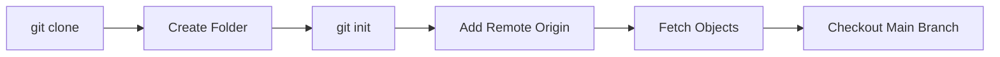

# Git Guide Update - Additional Section

## Git Clone Internals – What Happens Behind the Scenes

Most people use:

```bash
git clone https://github.com/example/myapp.git
```

Sample Output:

```text
Cloning into 'myapp'...
remote: Enumerating objects: 125, done.
remote: Counting objects: 100% (125/125), done.
Receiving objects: 100% (125/125), done.
Resolving deltas: 100% (42/42), done.
```

Behind the scenes Git effectively performs:

```bash
mkdir myapp
cd myapp

git init
git remote add origin https://github.com/example/myapp.git
git fetch origin
git checkout main
```

### What Each Step Does

| Step | Purpose |
|--------|---------|
| mkdir myapp | Creates project directory |
| cd myapp | Moves into project directory |
| git init | Creates local Git repository |
| git remote add origin | Configures remote repository |
| git fetch | Downloads commits, branches, tags |
| git checkout main | Creates working files from latest commit |


