# Complete Git Guide with Architecture, Commands, Examples, Outputs, Mermaid Diagrams, and Interview Questions

> GitHub-friendly Markdown document for learning Git from basics to interview level.

---

## Table of Contents

1. [What is Git?](#1-what-is-git)
2. [Why Git is Used](#2-why-git-is-used)
3. [Git Architecture](#3-git-architecture)
4. [Git Workflow Areas](#4-git-workflow-areas)
5. [Install and Configure Git](#5-install-and-configure-git)
6. [Create a New Repository](#6-create-a-new-repository)
7. [Clone an Existing Repository](#7-clone-an-existing-repository)
8. [Check Git Status](#8-check-git-status)
9. [Add Files to Staging Area](#9-add-files-to-staging-area)
10. [Commit Changes](#10-commit-changes)
11. [View Commit History](#11-view-commit-history)
12. [Git Branching](#12-git-branching)
13. [Switch Branches](#13-switch-branches)
14. [Merge Branches](#14-merge-branches)
15. [Resolve Merge Conflicts](#15-resolve-merge-conflicts)
16. [Git Remote Repository](#16-git-remote-repository)
17. [Git Push](#17-git-push)
18. [Git Fetch](#18-git-fetch)
19. [Git Pull](#19-git-pull)
20. [Git Fetch vs Git Pull](#20-git-fetch-vs-git-pull)
21. [Git Rebase](#21-git-rebase)
22. [Git Reset](#22-git-reset)
23. [Git Revert](#23-git-revert)
24. [Git Stash](#24-git-stash)
25. [Git Tag](#25-git-tag)
26. [Git Diff](#26-git-diff)
27. [Git Log Useful Commands](#27-git-log-useful-commands)
28. [Git Ignore](#28-git-ignore)
29. [Git Clean](#29-git-clean)
30. [Git Cherry-pick](#30-git-cherry-pick)
31. [Git Restore](#31-git-restore)
32. [Common Git Commands Summary](#32-common-git-commands-summary)
33. [Git Interview Questions and Answers](#33-git-interview-questions-and-answers)

---

## 1. What is Git?

Git is a distributed version control system. It helps developers track code changes, collaborate with others, create branches, merge code, and go back to older versions when needed.

### Simple Meaning

Git keeps the history of your project.

Example:

```text
Day 1: Created app.py
Day 2: Added login feature
Day 3: Fixed login bug
Day 4: Added payment feature
```

Git can show what changed, who changed it, and when it changed.

### Diagram

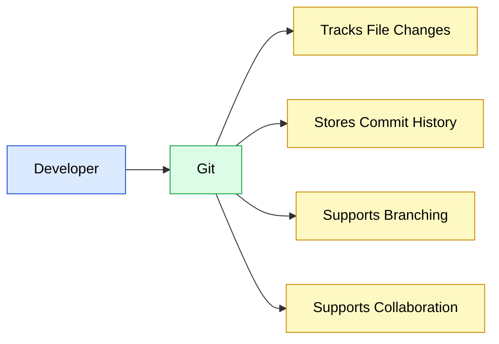

---

## 2. Why Git is Used

Git is used for:

- Tracking source code changes
- Working with multiple developers
- Creating feature branches
- Reverting mistakes
- Maintaining project history
- Supporting CI/CD pipelines
- Managing releases using tags

### Diagram

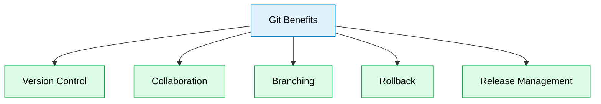

---

## 3. Git Architecture

Git has three main local areas and one remote repository.

| Area | Meaning |
|---|---|
| Working Directory | Files you are editing |
| Staging Area / Index | Files ready for commit |
| Local Repository | Committed history on your machine |
| Remote Repository | Shared repository like GitHub, GitLab, Bitbucket |

### Architecture Diagram

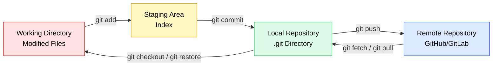

---

## 4. Git Workflow Areas

### Common Git Flow

```text
edit file -> git add -> git commit -> git push
```

### Diagram

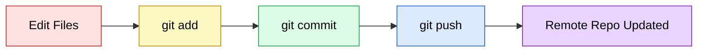

---

## 5. Install and Configure Git

### Install Git on Ubuntu

```bash
sudo apt update
sudo apt install git -y
```

### Sample Output

```text
Reading package lists... Done
Building dependency tree... Done
git is already the newest version.
```

### Check Git Version

```bash
git --version
```

### Sample Output

```text
git version 2.43.0
```

### Configure Username and Email

```bash
git config --global user.name "Sreejith"
git config --global user.email "sreejith@example.com"
```

### Verify Configuration

```bash
git config --list
```

### Sample Output

```text
user.name=Sreejith
user.email=sreejith@example.com
```

### Diagram

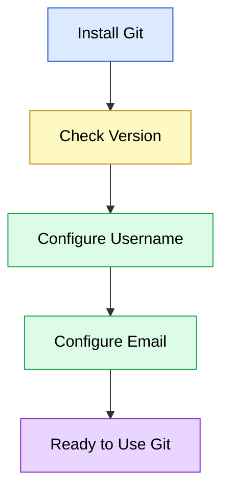

---

## 6. Create a New Repository

### Command

```bash
mkdir myapp
cd myapp
git init
```

### Sample Output

```text
Initialized empty Git repository in /home/sreejith/myapp/.git/
```

### What Happens?

Git creates a hidden `.git` directory. This directory stores Git metadata, commit history, branches, and configuration.

### Diagram

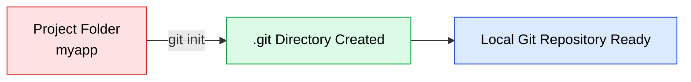

---

## 7. Clone an Existing Repository

### Command

```bash
git clone https://github.com/example/myapp.git
```

### Sample Output

```text
Cloning into 'myapp'...
remote: Enumerating objects: 25, done.
remote: Counting objects: 100% (25/25), done.
Receiving objects: 100% (25/25), done.
```

### What Happens?

Git downloads the remote repository to your local machine.

### Diagram

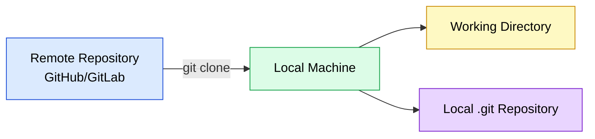

---

## 8. Check Git Status

### Command

```bash
git status
```

### Sample Output

```text
On branch main
nothing to commit, working tree clean
```

### After Creating a File

```bash
echo "Hello Git" > app.txt
git status
```

### Sample Output

```text
On branch main
Untracked files:
  app.txt

nothing added to commit but untracked files present
```

### Diagram

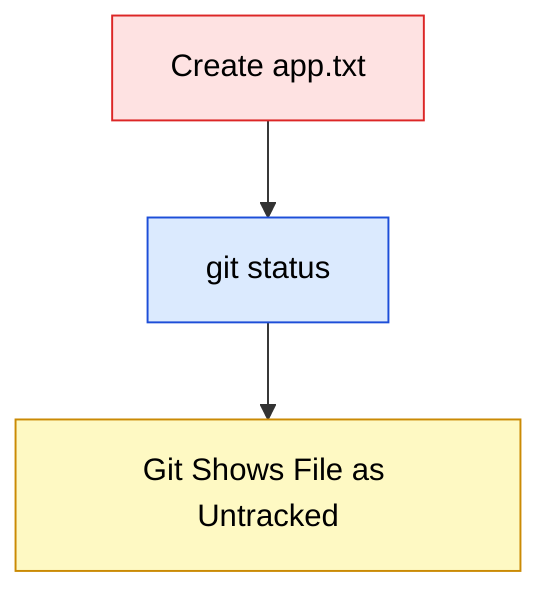

---

## 9. Add Files to Staging Area

### Add One File

```bash
git add app.txt
```

### Add All Files

```bash
git add .
```

### Check Status

```bash
git status
```

### Sample Output

```text
On branch main
Changes to be committed:
  new file:   app.txt
```

### Diagram

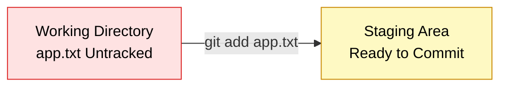

---

## 10. Commit Changes

### Command

```bash
git commit -m "Add app.txt file"
```

### Sample Output

```text
[main 7a9c2d1] Add app.txt file
 1 file changed, 1 insertion(+)
 create mode 100644 app.txt
```

### What Happens?

Git saves the staged changes permanently in the local repository.

### Diagram

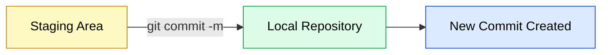

---

## 11. View Commit History

### Command

```bash
git log
```

### Sample Output

```text
commit 7a9c2d1e4c8d9a0b123456789abcdef12345678
Author: Sreejith <sreejith@example.com>
Date:   Mon Jun 22 10:30:00 2026 +0200

    Add app.txt file
```

### One Line Log

```bash
git log --oneline
```

### Sample Output

```text
7a9c2d1 Add app.txt file
```

### Diagram

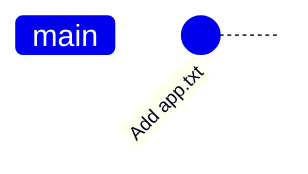

---

## 12. Git Branching

A branch is a separate line of development. Developers use branches to work on new features without affecting the main branch.

### Create Branch

```bash
git branch feature-login
```

### List Branches

```bash
git branch
```

### Sample Output

```text
  feature-login
* main
```

### Diagram

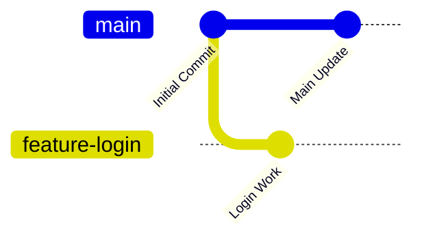

---

## 13. Switch Branches

### Command

```bash
git checkout feature-login
```

or newer command:

```bash
git switch feature-login
```

### Sample Output

```text
Switched to branch 'feature-login'
```

### Create and Switch Branch Together

```bash
git switch -c feature-payment
```

### Sample Output

```text
Switched to a new branch 'feature-payment'
```

### Diagram

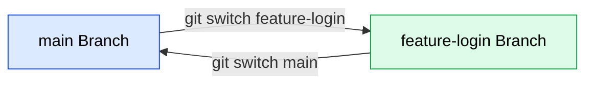

---

## 14. Merge Branches

Merging combines changes from one branch into another branch.

### Example

```bash
git switch main
git merge feature-login
```

### Sample Output

```text
Updating 7a9c2d1..8b7e3f2
Fast-forward
 login.txt | 1 +
 1 file changed, 1 insertion(+)
 create mode 100644 login.txt
```

### Diagram

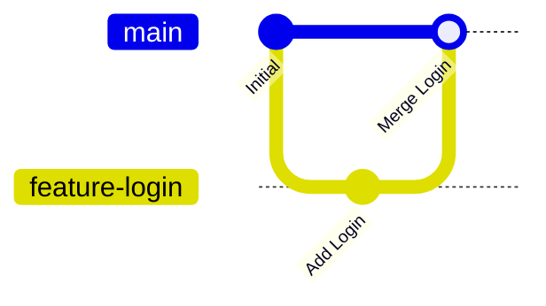

---

## 15. Resolve Merge Conflicts

A merge conflict happens when Git cannot automatically combine changes.

### Example Conflict File

```text
<<<<<<< HEAD
Hello from main branch
=======
Hello from feature branch
>>>>>>> feature-login
```

### Fix the File Manually

```text
Hello from main and feature branch
```

### Commands After Fixing

```bash
git add app.txt
git commit -m "Resolve merge conflict"
```

### Sample Output

```text
[main d45ac21] Resolve merge conflict
```

### Diagram

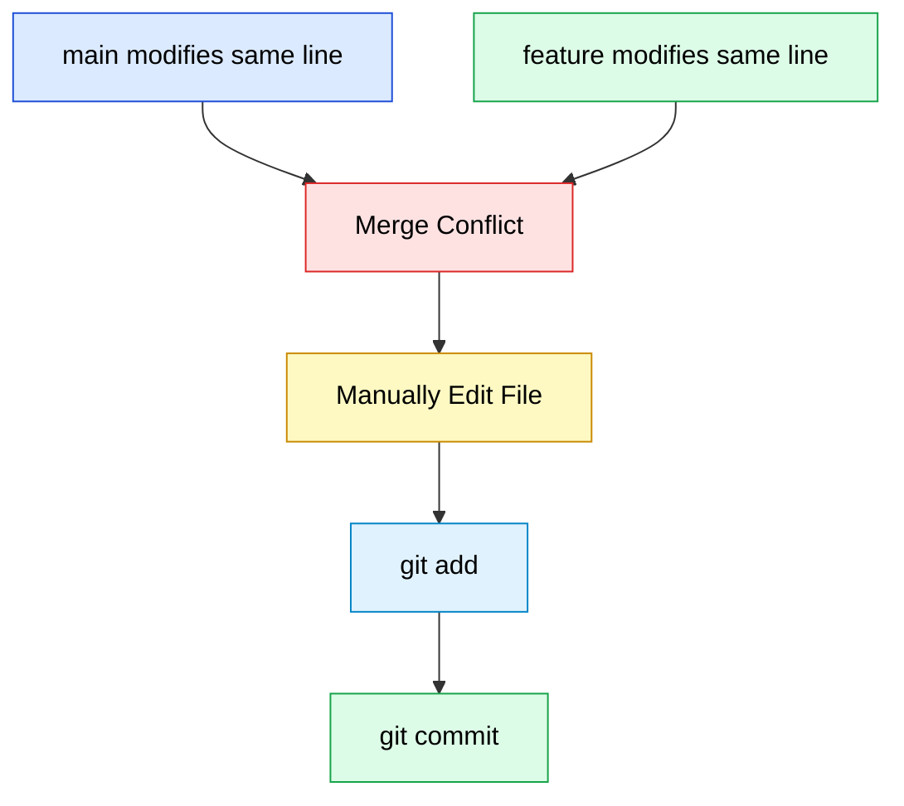

---

## 16. Git Remote Repository

A remote repository is a shared Git repository stored on GitHub, GitLab, Bitbucket, or another Git server.

### Add Remote

```bash
git remote add origin https://github.com/example/myapp.git
```

### View Remote

```bash
git remote -v
```

### Sample Output

```text
origin  https://github.com/example/myapp.git (fetch)
origin  https://github.com/example/myapp.git (push)
```

### Diagram

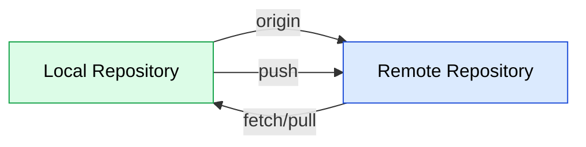

---

## 17. Git Push

Push sends local commits to the remote repository.

### Command

```bash
git push origin main
```

### Sample Output

```text
Enumerating objects: 5, done.
Counting objects: 100% (5/5), done.
Writing objects: 100% (3/3), 350 bytes | 350.00 KiB/s, done.
To https://github.com/example/myapp.git
   7a9c2d1..8b7e3f2  main -> main
```

### Diagram

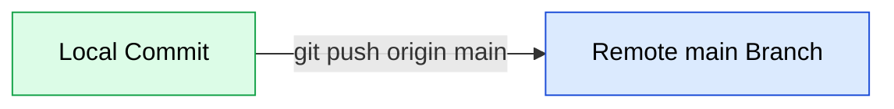

---

## 18. Git Fetch

`git fetch` downloads remote changes but does not merge them into your current branch.

### Command

```bash
git fetch origin
```

### Sample Output

```text
remote: Enumerating objects: 4, done.
remote: Counting objects: 100% (4/4), done.
From https://github.com/example/myapp
   8b7e3f2..c91e6ab  main       -> origin/main
```

### What Happens?

Remote tracking branch `origin/main` is updated, but your local `main` branch is not changed.

### Diagram

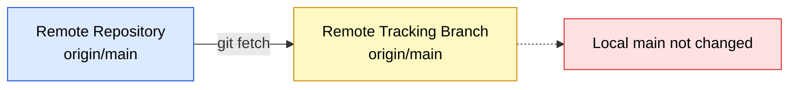

---

## 19. Git Pull

`git pull` downloads remote changes and merges them into your current branch.

### Command

```bash
git pull origin main
```

### Sample Output

```text
From https://github.com/example/myapp
 * branch            main       -> FETCH_HEAD
Updating 8b7e3f2..c91e6ab
Fast-forward
 README.md | 2 ++
 1 file changed, 2 insertions(+)
```

### Diagram

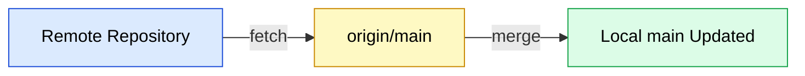

---

## 20. Git Fetch vs Git Pull

| Command | Downloads Remote Changes | Updates Local Branch | Safe for Review |
|---|---:|---:|---:|
| `git fetch` | Yes | No | Yes |
| `git pull` | Yes | Yes | Less safe than fetch |

### Simple Explanation

`git fetch` means: download changes only.

`git pull` means: download changes and merge into my current branch.

### Example

```bash
git fetch origin
git log main..origin/main --oneline
git merge origin/main
```

This is a safer manual way to pull.

### Diagram

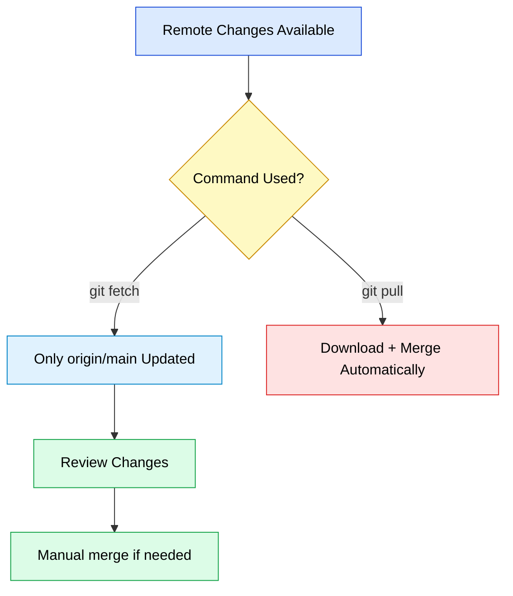

---

## 21. Git Rebase

Rebase moves your branch commits on top of another branch.

### Command

```bash
git switch feature-login
git rebase main
```

### Sample Output

```text
Successfully rebased and updated refs/heads/feature-login.
```

### Use Case

Use rebase to keep a clean linear history.

### Diagram

```mermaid
gitGraph
    commit id: "A"
    commit id: "B"
    branch feature
    checkout feature
    commit id: "F1"
    checkout main
    commit id: "C"
    checkout feature
    commit id: "F1 rebased"
```

### Important Note

Avoid rebasing shared public branches unless your team agrees.

---

## 22. Git Reset

`git reset` moves HEAD and can remove changes from staging or commit history.

### Soft Reset

Keeps changes staged.

```bash
git reset --soft HEAD~1
```

### Mixed Reset

Keeps changes in working directory but unstages them.

```bash
git reset --mixed HEAD~1
```

### Hard Reset

Deletes commit and working changes.

```bash
git reset --hard HEAD~1
```

### Sample Output

```text
HEAD is now at 7a9c2d1 Add app.txt file
```

### Diagram

```mermaid
flowchart TD
    A[Latest Commit] --> B{git reset type}
    B -->|--soft| C[Commit removed<br/>Changes staged]
    B -->|--mixed| D[Commit removed<br/>Changes unstaged]
    B -->|--hard| E[Commit and changes deleted]

    style A fill:#dbeafe,stroke:#1d4ed8,color:#000
    style B fill:#fef9c3,stroke:#ca8a04,color:#000
    style C fill:#dcfce7,stroke:#16a34a,color:#000
    style D fill:#fde68a,stroke:#d97706,color:#000
    style E fill:#fee2e2,stroke:#dc2626,color:#000
```

---

## 23. Git Revert

`git revert` creates a new commit that undoes an old commit. It is safer than reset for shared branches.

### Command

```bash
git revert 8b7e3f2
```

### Sample Output

```text
[main e12fabc] Revert "Add login feature"
 1 file changed, 1 deletion(-)
```

### Diagram

```mermaid
gitGraph
    commit id: "A"
    commit id: "Bad Commit"
    commit id: "Revert Bad Commit"
```

---

## 24. Git Stash

Stash temporarily saves uncommitted changes.

### Save Changes

```bash
git stash
```

### Sample Output

```text
Saved working directory and index state WIP on main: 7a9c2d1 Add app.txt file
```

### List Stashes

```bash
git stash list
```

### Sample Output

```text
stash@{0}: WIP on main: 7a9c2d1 Add app.txt file
```

### Apply Stash

```bash
git stash apply
```

### Apply and Remove Stash

```bash
git stash pop
```

### Diagram

```mermaid
flowchart LR
    A[Uncommitted Changes] -->|git stash| B[Temporary Stash Area]
    B -->|git stash apply/pop| C[Changes Restored]

    style A fill:#fee2e2,stroke:#dc2626,color:#000
    style B fill:#fef9c3,stroke:#ca8a04,color:#000
    style C fill:#dcfce7,stroke:#16a34a,color:#000
```

---

## 25. Git Tag

Tags are used to mark release points.

### Create Tag

```bash
git tag v1.0.0
```

### Push Tag

```bash
git push origin v1.0.0
```

### Sample Output

```text
To https://github.com/example/myapp.git
 * [new tag]         v1.0.0 -> v1.0.0
```

### Diagram

```mermaid
gitGraph
    commit id: "Initial"
    commit id: "Feature Complete" tag: "v1.0.0"
```

---

## 26. Git Diff

`git diff` shows file differences.

### Show Unstaged Changes

```bash
git diff
```

### Sample Output

```diff
diff --git a/app.txt b/app.txt
index e69de29..557db03 100644
--- a/app.txt
+++ b/app.txt
@@ -0,0 +1 @@
+Hello Git
```

### Show Staged Changes

```bash
git diff --staged
```

### Diagram

```mermaid
flowchart TD
    A[Modify File] --> B{git diff type}
    B -->|git diff| C[Show unstaged changes]
    B -->|git diff --staged| D[Show staged changes]

    style A fill:#fee2e2,stroke:#dc2626,color:#000
    style B fill:#fef9c3,stroke:#ca8a04,color:#000
    style C fill:#dcfce7,stroke:#16a34a,color:#000
    style D fill:#dbeafe,stroke:#1d4ed8,color:#000
```

---

## 27. Git Log Useful Commands

### Compact History

```bash
git log --oneline
```

### Graph View

```bash
git log --oneline --graph --decorate --all
```

### Sample Output

```text
* c91e6ab (HEAD -> main, origin/main) Update README
* 8b7e3f2 Add login feature
* 7a9c2d1 Add app.txt file
```

### Diagram

```mermaid
gitGraph
    commit id: "Add app.txt"
    commit id: "Add login"
    commit id: "Update README"
```

---

## 28. Git Ignore

`.gitignore` tells Git to ignore files.

### Example `.gitignore`

```gitignore
*.log
target/
node_modules/
.env
```

### Command

```bash
cat > .gitignore <<'EOT'
*.log
target/
node_modules/
.env
EOT
```

### Add and Commit

```bash
git add .gitignore
git commit -m "Add gitignore file"
```

### Diagram

```mermaid
flowchart LR
    A[Project Files] --> B{.gitignore Rules}
    B -->|Allowed| C[Tracked by Git]
    B -->|Ignored| D[Not Tracked]

    style A fill:#dbeafe,stroke:#1d4ed8,color:#000
    style B fill:#fef9c3,stroke:#ca8a04,color:#000
    style C fill:#dcfce7,stroke:#16a34a,color:#000
    style D fill:#fee2e2,stroke:#dc2626,color:#000
```

---

## 29. Git Clean

`git clean` removes untracked files.

### Dry Run

```bash
git clean -n
```

### Sample Output

```text
Would remove temp.txt
```

### Delete Untracked Files

```bash
git clean -f
```

### Diagram

```mermaid
flowchart TD
    A[Untracked Files] --> B[git clean -n]
    B --> C[Preview Files to Remove]
    C --> D[git clean -f]
    D --> E[Untracked Files Removed]

    style A fill:#fee2e2,stroke:#dc2626,color:#000
    style B fill:#fef9c3,stroke:#ca8a04,color:#000
    style C fill:#dbeafe,stroke:#1d4ed8,color:#000
    style D fill:#fef9c3,stroke:#ca8a04,color:#000
    style E fill:#dcfce7,stroke:#16a34a,color:#000
```

---

## 30. Git Cherry-pick

Cherry-pick applies one specific commit from another branch.

### Command

```bash
git cherry-pick 8b7e3f2
```

### Sample Output

```text
[main 45fd9a1] Add login feature
 Date: Mon Jun 22 11:00:00 2026 +0200
 1 file changed, 1 insertion(+)
```

### Diagram

```mermaid
gitGraph
    commit id: "A"
    branch feature
    checkout feature
    commit id: "F1"
    commit id: "F2"
    checkout main
    cherry-pick id: "F1 copied"
```

---

## 31. Git Restore

`git restore` is used to discard working directory changes or unstage files.

### Discard File Changes

```bash
git restore app.txt
```

### Unstage File

```bash
git restore --staged app.txt
```

### Diagram

```mermaid
flowchart TD
    A[Modified File] -->|git restore file| B[Changes Discarded]
    C[Staged File] -->|git restore --staged file| D[Moved Back to Working Directory]

    style A fill:#fee2e2,stroke:#dc2626,color:#000
    style B fill:#dcfce7,stroke:#16a34a,color:#000
    style C fill:#fef9c3,stroke:#ca8a04,color:#000
    style D fill:#dbeafe,stroke:#1d4ed8,color:#000
```

---

## 32. Common Git Commands Summary

| Command | Usage |
|---|---|
| `git init` | Create a new Git repository |
| `git clone <url>` | Copy remote repository locally |
| `git status` | Check file status |
| `git add <file>` | Add file to staging area |
| `git add .` | Add all changed files |
| `git commit -m "msg"` | Save staged changes locally |
| `git log --oneline` | Show compact commit history |
| `git branch` | List branches |
| `git branch <name>` | Create branch |
| `git switch <name>` | Switch branch |
| `git switch -c <name>` | Create and switch branch |
| `git merge <branch>` | Merge branch into current branch |
| `git remote -v` | Show remote URLs |
| `git push origin main` | Push local commits to remote main |
| `git fetch origin` | Download remote changes only |
| `git pull origin main` | Download and merge remote changes |
| `git stash` | Temporarily save uncommitted changes |
| `git stash pop` | Restore and remove latest stash |
| `git diff` | Show unstaged changes |
| `git diff --staged` | Show staged changes |
| `git tag v1.0.0` | Create release tag |
| `git revert <commit>` | Safely undo commit with new commit |
| `git reset --hard HEAD~1` | Delete latest commit and changes |

---

## 33. Git Interview Questions and Answers

### Q1. What is Git?

Git is a distributed version control system used to track source code changes and collaborate with multiple developers.

### Q2. What is the difference between Git and GitHub?

Git is the version control tool. GitHub is a cloud platform that hosts Git repositories.

```mermaid
flowchart LR
    A[Git<br/>Version Control Tool] --> B[GitHub<br/>Repository Hosting Platform]

    style A fill:#dcfce7,stroke:#16a34a,color:#000
    style B fill:#dbeafe,stroke:#1d4ed8,color:#000
```

### Q3. What is a Git repository?

A Git repository is a project folder tracked by Git. It contains a hidden `.git` directory that stores history and metadata.

### Q4. What is the difference between working directory, staging area, and local repository?

| Area | Purpose |
|---|---|
| Working Directory | Where files are edited |
| Staging Area | Where files are prepared for commit |
| Local Repository | Where commits are saved |

### Q5. What is the difference between `git fetch` and `git pull`?

`git fetch` downloads changes from remote but does not merge them.

`git pull` downloads changes and merges them into the current branch.

```mermaid
flowchart TD
    A[Remote Repo] -->|git fetch| B[origin/main only]
    A -->|git pull| C[origin/main + local branch updated]

    style A fill:#dbeafe,stroke:#1d4ed8,color:#000
    style B fill:#fef9c3,stroke:#ca8a04,color:#000
    style C fill:#dcfce7,stroke:#16a34a,color:#000
```

### Q6. What is the difference between `git merge` and `git rebase`?

| Command | Meaning |
|---|---|
| `git merge` | Combines branches and may create a merge commit |
| `git rebase` | Moves commits on top of another branch and creates linear history |

### Q7. What is a branch in Git?

A branch is an independent line of development. It allows developers to work on features without disturbing the main branch.

### Q8. What is a merge conflict?

A merge conflict happens when two branches change the same line or same part of a file and Git cannot decide which change to keep.

### Q9. How do you resolve a merge conflict?

1. Open the conflicted file.
2. Remove conflict markers.
3. Keep the correct changes.
4. Run `git add <file>`.
5. Run `git commit`.

### Q10. What is `git stash`?

`git stash` temporarily saves uncommitted changes so you can work on something else.

### Q11. What is the difference between `git reset` and `git revert`?

| Command | Meaning | Safe for Shared Branch? |
|---|---|---|
| `git reset` | Removes commits by moving HEAD | No |
| `git revert` | Creates a new commit to undo changes | Yes |

### Q12. What is HEAD in Git?

HEAD is a pointer to the current branch or current commit.

### Q13. What is origin in Git?

`origin` is the default name for the remote repository.

### Q14. What is a Git tag?

A tag is a fixed reference to a commit. Tags are usually used for releases like `v1.0.0`.

### Q15. What is `.gitignore`?

`.gitignore` defines files and directories Git should not track.

### Q16. What is the command to create a new branch and switch to it?

```bash
git switch -c feature-login
```

or

```bash
git checkout -b feature-login
```

### Q17. What is the command to push a local branch to remote?

```bash
git push origin feature-login
```

### Q18. What is fast-forward merge?

A fast-forward merge happens when the target branch has no new commits, so Git simply moves the branch pointer forward.

```mermaid
gitGraph
    commit id: "A"
    commit id: "B"
    branch feature
    checkout feature
    commit id: "C"
    checkout main
    merge feature id: "Fast-forward"
```

### Q19. What is a detached HEAD?

Detached HEAD means Git is pointing directly to a commit instead of a branch.

### Q20. What is cherry-pick?

Cherry-pick applies a specific commit from one branch into another branch.

### Q21. How do you undo the last commit but keep changes?

```bash
git reset --soft HEAD~1
```

### Q22. How do you undo the last commit and delete changes?

```bash
git reset --hard HEAD~1
```

### Q23. How do you see remote branches?

```bash
git branch -r
```

### Q24. How do you delete a local branch?

```bash
git branch -d feature-login
```

Force delete:

```bash
git branch -D feature-login
```

### Q25. How do you delete a remote branch?

```bash
git push origin --delete feature-login
```

### Q26. How do you check changes before commit?

```bash
git diff
git diff --staged
```

### Q27. How do you see who changed each line of a file?

```bash
git blame app.txt
```

### Q28. How do you compare two branches?

```bash
git diff main..feature-login
```

### Q29. What is the difference between `git checkout` and `git switch`?

`git checkout` can switch branches and restore files. `git switch` is mainly used for switching branches and is easier to understand.

### Q30. What is the best daily Git workflow?

```bash
git pull origin main
git switch -c feature-new-work
# edit files
git add .
git commit -m "Add new work"
git push origin feature-new-work
```

### Daily Workflow Diagram

```mermaid
flowchart TD
    A[Pull latest main] --> B[Create feature branch]
    B --> C[Edit files]
    C --> D[git add]
    D --> E[git commit]
    E --> F[git push]
    F --> G[Create Pull Request / Merge Request]

    style A fill:#dbeafe,stroke:#1d4ed8,color:#000
    style B fill:#dcfce7,stroke:#16a34a,color:#000
    style C fill:#fee2e2,stroke:#dc2626,color:#000
    style D fill:#fef9c3,stroke:#ca8a04,color:#000
    style E fill:#dcfce7,stroke:#16a34a,color:#000
    style F fill:#dbeafe,stroke:#1d4ed8,color:#000
    style G fill:#e9d5ff,stroke:#7e22ce,color:#000
```

---

## Final Recommended Git Practice

For team work, follow this safe workflow:

```bash
git switch main
git pull origin main
git switch -c feature/my-change
# make changes
git add .
git commit -m "Clear message explaining change"
git push origin feature/my-change
```

Then create a Pull Request or Merge Request in GitHub/GitLab.

---

## End of Document

